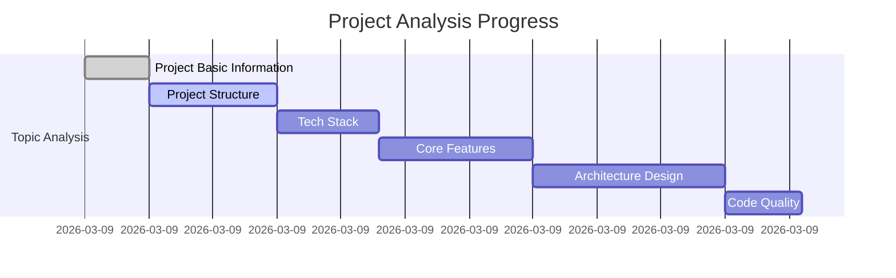

# Project Analysis Change Log

This document records all documents created during the project analysis process and tracks analysis progress.

## 📋 Analysis Overview

- **Project Name**: [Project Name]
- **Project Path**: [Project Path]
- **Analysis Mode**: [Quick Assessment/Standard Analysis/Deep Analysis]
- **Analysis Start Time**: [Start Timestamp]
- **Estimated Completion**: [Estimated Completion]
- **Current Status**: [In Progress/Completed]

---

## 🔄 Analysis Change Records

### [Date] - Analysis Initiation

**Time**: [Timestamp]
**Operation**: Started project analysis
**Details**: Created analysis directory structure, initialized document templates

**Created Files**:
- `ai-analysis-docs/changelog.md`
- `ai-analysis-docs/[project-name]-analysis.md`
- `ai-analysis-docs/[project-name]-progress-tracking.md`
- `ai-analysis-docs/analysis-todo.md`
- `ai-analysis-docs/topics/` (directory)

---

## 📝 Topic Document Creation Records

In reverse chronological order (most recent first)

### [Date] - [Topic Name] Completed

**Time**: [Timestamp]
**Topic**: [Topic Number]. [Topic Name]
**Progress**: [X/12]
**Duration**: [X minutes]

**Created Document**:
- 📄 `topics/[XX]-[topic-name].md` ([file-size] KB)

**Key Findings**:
- [Key finding 1]
- [Key finding 2]
- [Key finding 3]

**Updated Files**:
- ✏️ `[project-name]-analysis.md` (added [Topic Name] section)
- ✏️ `[project-name]-progress-tracking.md` (marked topic [X] as completed)
- ✏️ `analysis-todo.md` (updated progress status)

**Generated Diagrams**:
- 📊 `[diagram-name].mmd` (if applicable)

---

### [Example] - Project Basic Information Completed

**Time**: 2026-03-09 14:30:00
**Topic**: 01. Project Basic Information
**Progress**: 1/12
**Duration**: 5 minutes

**Created Document**:
- 📄 `topics/01-project-basic-info.md` (12 KB)

**Key Findings**:
• Project: Kubernetes (container orchestration system)
• Main language: Go (95%+)
• Total files: 50,000+
• Lines of code: 3 million+ lines

**Updated Files**:
- ✏️ `kubernetes-analysis.md` (added Project Basic Information section)
- ✏️ `kubernetes-progress-tracking.md` (marked topic 1 as completed)
- ✏️ `analysis-todo.md` (updated progress status 1/12)

**Generated Diagrams**:
- 📊 `language-distribution.mmd`

---

## 📊 Analysis Statistics

### Document Creation Statistics

| Category | Created Count | Total Size | Last Updated |
|----------|----------------|------------|--------------|
| Topic Documents | X/12 | [Total Size] | [timestamp] |
| Main Report Updates | X times | [Size] | [timestamp] |
| Diagram Files | X files | [Size] | [timestamp] |
| **Total** | **[X]** | **[Total Size]** | **[timestamp]** |

### Time Statistics

| Phase | Start Time | End Time | Duration |
|-------|------------|----------|----------|
| Preparation Phase | [timestamp] | [timestamp] | [X minutes] |
| Topic Analysis | [timestamp] | [timestamp] | [X minutes] |
| Report Generation | [timestamp] | [timestamp] | [X minutes] |
| **Total** | [timestamp] | [timestamp] | **[X minutes]** |

---

## 🎯 Milestones

- [x] **[timestamp]** - Analysis started
- [x] **[timestamp]** - First topic completed
- [ ] **[timestamp]** - Halfway through topics (6/12)
- [ ] **[timestamp]** - All topics completed
- [ ] **[timestamp]** - Final report generated

---

## 🔗 Related Documents

- **Main Analysis Report**: `[project-name]-analysis.md`
- **Progress Tracking**: `[project-name]-progress-tracking.md`
- **TODO List**: `analysis-todo.md`
- **Topic Documents Directory**: `topics/`

---

## 📈 Analysis Activity Diagram

---

*This document is automatically maintained by project-analyzer skill*
*Last updated: [auto-updated timestamp]*
*Update frequency: Updated once after completing each topic*