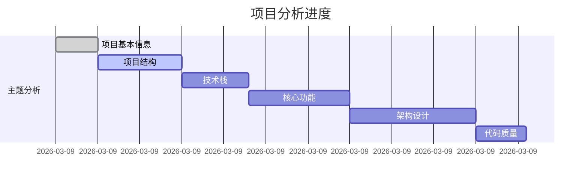

# 项目分析变更日志

本文档记录项目分析过程中创建的所有文档和分析进度。

## 📋 分析概览

- **项目名称**: [Project Name]
- **项目路径**: [Project Path]
- **分析模式**: [快速评估/标准分析/深度分析]
- **分析开始时间**: [Start Timestamp]
- **预计完成时间**: [Estimated Completion]
- **当前状态**: [In Progress/Completed]

---

## 🔄 分析变更记录

### [日期] - 分析启动

**时间**: [Timestamp]
**操作**: 启动项目分析
**详情**: 创建分析目录结构，初始化文档模板

**创建的文件**:
- `ai-analysis-docs/changelog.md`
- `ai-analysis-docs/[project-name]-分析.md`
- `ai-analysis-docs/[project-name]-进度追踪.md`
- `ai-analysis-docs/analysis-todo.md`
- `ai-analysis-docs/topics/` (目录)

---

## 📝 主题文档创建记录

按时间倒序排列（最新的在最前面）

### [日期] - [主题名称] 完成

**时间**: [Timestamp]
**主题**: [Topic Number]. [Topic Name]
**进度**: [X/12]
**耗时**: [X分钟]

**创建的文档**:
- 📄 `topics/[XX]-[topic-name].md` ([file-size] KB)

**关键发现**:
- [Key finding 1]
- [Key finding 2]
- [Key finding 3]

**更新的文件**:
- ✏️ `[project-name]-分析.md` (添加 [主题名称] 章节)
- ✏️ `[project-name]-进度追踪.md` (标记主题 [X] 完成)
- ✏️ `analysis-todo.md` (更新进度状态)

**生成的图表**:
- 📊 `[diagram-name].mmd` (如适用)

---

### [示例] - 项目基本信息 完成

**时间**: 2026-03-09 14:30:00
**主题**: 01. 项目基本信息
**进度**: 1/12
**耗时**: 5分钟

**创建的文档**:
- 📄 `topics/01-项目基本信息.md` (12 KB)

**关键发现**:
• 项目: Kubernetes (容器编排系统)
• 主要语言: Go (95%+)
• 文件总数: 50,000+
• 代码行数: 300万+ 行

**更新的文件**:
- ✏️ `kubernetes-分析.md` (添加 项目基本信息 章节)
- ✏️ `kubernetes-进度追踪.md` (标记主题 1 完成)
- ✏️ `analysis-todo.md` (更新进度状态 1/12)

**生成的图表**:
- 📊 `language-distribution.mmd`

---

## 📊 分析统计

### 文档创建统计

| 类别 | 创建数量 | 总大小 | 最后更新 |
|------|---------|--------|---------|
| 主题文档 | X/12 | [总大小] | [timestamp] |
| 主报告更新 | X次 | [大小] | [timestamp] |
| 图表文件 | X个 | [大小] | [timestamp] |
| **总计** | **[X]** | **[总大小]** | **[timestamp]** |

### 时间统计

| 阶段 | 开始时间 | 结束时间 | 耗时 |
|------|---------|---------|------|
| 准备阶段 | [timestamp] | [timestamp] | [X分钟] |
| 主题分析 | [timestamp] | [timestamp] | [X分钟] |
| 报告生成 | [timestamp] | [timestamp] | [X分钟] |
| **总计** | [timestamp] | [timestamp] | **[X分钟]** |

---

## 🎯 里程碑

- [x] **[timestamp]** - 分析启动
- [x] **[timestamp]** - 第一个主题完成
- [ ] **[timestamp]** - 完成一半主题 (6/12)
- [ ] **[timestamp]** - 所有主题完成
- [ ] **[timestamp]** - 最终报告生成

---

## 🔗 相关文档

- **主分析报告**: `[project-name]-分析.md`
- **进度追踪**: `[project-name]-进度追踪.md`
- **待办清单**: `analysis-todo.md`
- **主题文档目录**: `topics/`

---

## 📈 分析活动图表

---

*本文档由 project-analyzer skill 自动维护*
*最后更新: [auto-updated timestamp]*
*更新频率: 每完成一个主题更新一次*