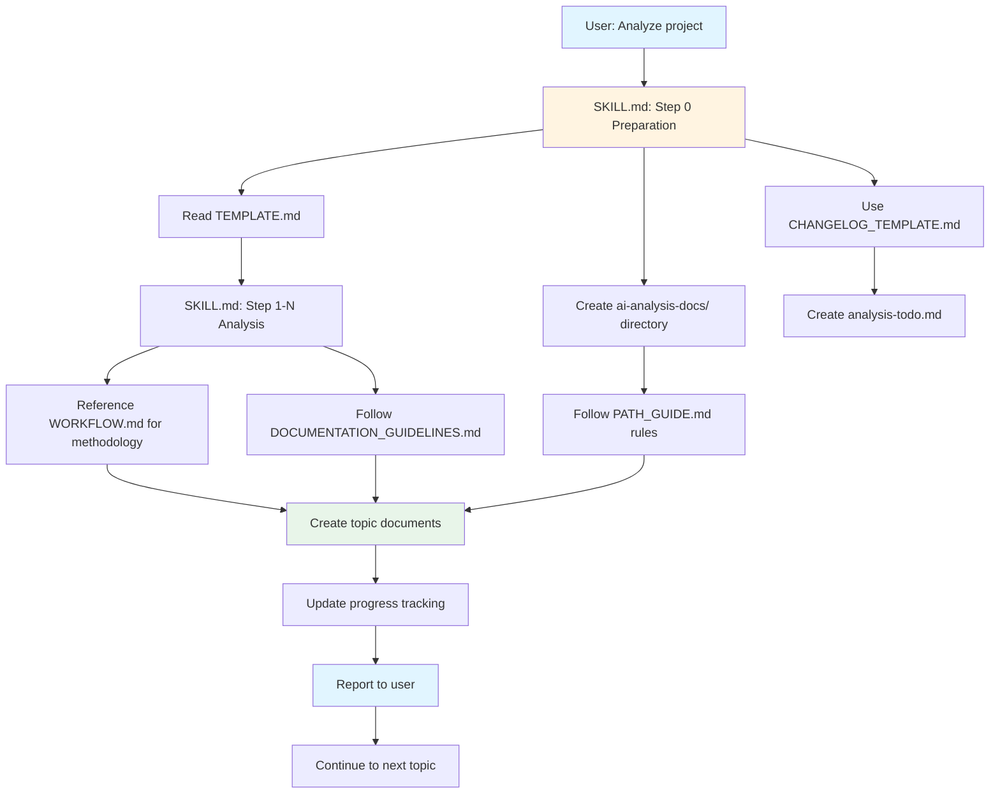

# project-analyzer

A comprehensive open source project analysis skill for OpenClaw agents.

## Features

- 📋 12-step complete analysis process + 8-step deep analysis option
- 🔬 Three analysis modes: Quick Assessment, Standard Analysis, Deep Dive
- 📊 Mermaid visualization diagrams (architecture diagrams, flowcharts, dependency diagrams, etc.)
- 💻 Local project analysis support (no GitHub API required)
- 💻 Source code-level deep analysis capability (function call chains, data structures, implementation mechanisms)
- 📈 **Progressive Documentation Creation**: Create independent documents for each topic immediately
- 📁 **Structured File Organization**: Automatically generate project directories and categorized files
- 🔄 **Real-time Progress Tracking**: View analysis progress and status at any time
- 📝 **Change Log Recording**: Automatically record all document creation activities
- 💾 **Incremental Save Mechanism**: Prevent data loss and ensure content safety
- 🫀 **Heartbeat Detection**: OpenClaw memory-based progress tracking prevents analysis interruption
- 🔄 **Resume Capability**: Automatically recover from interruptions and continue analysis
- 🎯 Systematic analysis framework based on Kubernetes analysis methodology

## Use Cases

### Quick Assessment Mode
- Quick project overview understanding
- Technical selection decisions
- Preliminary quality assessment

### Standard Analysis Mode
- Analyze open source project architecture
- Evaluate GitHub repository quality
- Understand tech stack and dependencies
- Learn excellent code organization practices

### Deep Analysis Mode
- Source code-level mechanism dissection
- Performance and security analysis
- Implementation details and best practices
- Technical in-depth research

## Usage

When users ask to analyze an open source project (e.g., "analyze facebook/react"), the skill will automatically:

1. Create structured project directories
2. Analyze each topic step by step (create and save each topic document immediately upon completion)
3. Create independent documents for each topic
4. Update progress tracking documents in real-time
5. Generate visualization diagrams
6. Integrate main comprehensive reports
7. Provide complete project analysis documentation suite

### 📁 Generated Documentation Structure

```
[project-name]/
└── ai-analysis-docs/                   # Unified storage for all analysis documents
    ├── changelog.md                   # Analysis change log ✨
    ├── [project-name]-analysis.md     # Main comprehensive report
    ├── [project-name]-progress-tracking.md  # Real-time progress tracking
    ├── analysis-todo.md               # Analysis TODO list
    ├── topics/                        # 12-20 independent topic documents
    │   ├── 01-project-basic-info.md
    │   ├── 02-project-structure.md
    │   └── ...
    └── assets/                        # Diagrams and resources
        ├── diagrams/
        └── images/
```

## Analysis Topics

### Standard Analysis (12 Topics)
1. 📋 Project Basic Information
2. 🏗️ Project Structure
3. 🛠️ Tech Stack
4. 🎯 Core Features
5. 🏛️ Architecture Design
6. 📊 Code Quality
7. 📚 Documentation Quality
8. 📈 Project Activity
9. ✅ Strengths/Weaknesses
10. 🎯 Use Cases
11. 💡 Learning Value
12. 📝 Summary

### Deep Analysis (Additional 8 Topics)
13. 🔧 Source Code Deep Dive
14. ⚙️ Implementation Mechanics Analysis
15. 🔍 Key Component Analysis
16. 📐 Protocol & Interface Analysis
17. 🚀 Workflow Tracing
18. 🛡️ Security Analysis
19. ⚡ Performance Analysis
20. 🧪 Testing Strategy Analysis

## Installation

Install via OpenClaw skills CLI:

```bash
npx skills add [your-username]/project-analyzer
```

Or manual installation:

```bash
# Clone to skills directory
git clone https://github.com/[your-username]/project-analyzer ~/.openclaw/skills/project-analyzer

# Or
git clone https://github.com/[your-username]/project-analyzer ~/.agents/skills/project-analyzer
```

## File Structure

```
project-analyzer/
├── SKILL.md                    # 👨‍💻 Main skill definition - orchestrates the entire analysis process
├── TEMPLATE.md                 # 📋 Analysis template - used in Step 0 to define structure
├── CHANGELOG_TEMPLATE.md       # 📝 Changelog template - used in Step 0 to create TODO list
├── WORKFLOW.md                 # 🔄 Progressive workflow guide - provides deep-dive methodology
├── DOCUMENTATION_GUIDELINES.md # 📚 Documentation standards - defines file organization rules
├── PATH_GUIDE.md              # 🛣️ Path storage guide - ensures correct document locations
├── EXAMPLE_WORKFLOW.md         # 🎯 Usage examples - demonstrates complete analysis flow
├── INTEGRATION_SUMMARY.md      # 🎉 Integration summary - records Kubernetes methodology
├── README.md                   # 📖 This file - project overview and quick start
└── .gitignore
```

## Documentation Usage Guide

### How Supporting Documents Work Together

The project-analyzer skill uses a comprehensive documentation system where each file serves a specific purpose:

#### 🎯 **Core Execution Files**

**SKILL.md** - The main orchestration file
- **When used**: During every analysis execution
- **Purpose**: Coordinates all other files and defines the analysis workflow
- **Key sections**:
  - Step 0: Preparation (reads TEMPLATE.md and CHANGELOG_TEMPLATE.md)
  - Step 1-N: Progressive analysis cycle
  - Template and guide locations reference

**TEMPLATE.md** - Analysis structure template
- **When used**: Step 0 - Preparation phase
- **How used**: `SKILL.md` instructs to read from `~/.agents/skills/project-analyzer/TEMPLATE.md`
- **Purpose**: Defines all 20 analysis topics (12 standard + 8 deep-dive)
- **Content**: Topic structure, required information, diagram placeholders

**CHANGELOG_TEMPLATE.md** - TODO and changelog template
- **When used**: Step 0 - Preparation phase
- **How used**: `SKILL.md` uses it to create `analysis-todo.md`
- **Purpose**: Initializes the TODO list with all planned topics
- **Content**: TODO structure, progress tracking, milestone templates

#### 📚 **Guideline and Reference Files**

**WORKFLOW.md** - Progressive analysis methodology
- **When used**: Throughout analysis for guidance
- **Purpose**: Provides systematic deep-dive analysis methods
- **Key content**:
  - Progressive analysis strategy (Foundation → Architecture → Ecosystem → Deep Technical)
  - Code analysis methodology
  - Quality indicator checklists
  - Progressive deep-dive steps

**DOCUMENTATION_GUIDELINES.md** - File organization standards
- **When used**: When creating and organizing analysis documents
- **Purpose**: Ensures consistent file structure and naming conventions
- **Key content**:
  - Directory structure rules
  - File naming conventions (`XX-[topic-name].md`)
  - Document templates for each file type
  - Quality control standards

**PATH_GUIDE.md** - Path storage guide
- **When used**: Step 0 - Preparation phase and throughout analysis
- **Purpose**: Ensures all documents are saved in correct locations
- **Core principle**: "Analysis documents are ALWAYS saved inside the `ai-analysis-docs/` directory of the project being analyzed"
- **Key content**:
  - Correct vs incorrect path examples
  - Path resolution rules
  - Migration guide for old structures

#### 🎯 **Example and Reference Files**

**EXAMPLE_WORKFLOW.md** - Complete usage demonstration
- **When used**: As reference for understanding the analysis flow
- **Purpose**: Shows real-world example using Kubernetes project
- **Key content**:
  - Step-by-step execution example
  - Progress reporting format
  - Document creation sequence
  - User experience demonstration

**INTEGRATION_SUMMARY.md** - Methodology documentation
- **When used**: For understanding the skill's analytical foundation
- **Purpose**: Documents how Kubernetes analysis methodology was integrated
- **Key content**:
  - Five core principles from Kubernetes analysis
  - Three analysis modes (Quick/Standard/Deep)
  - Deep analysis capabilities (8 additional topics)

### 🔄 Document Usage Flow



### 📋 File Reference Summary

| File | Used In Phase | Usage Method | Purpose |
|------|--------------|--------------|---------|
| **SKILL.md** | All phases | Main execution orchestration | Coordinates entire analysis process |
| **TEMPLATE.md** | Step 0 | Read via path reference | Defines analysis structure and topics |
| **CHANGELOG_TEMPLATE.md** | Step 0 | Template for TODO creation | Initialize analysis planning |
| **WORKFLOW.md** | All phases | Reference guidance | Provides analysis methodology |
| **DOCUMENTATION_GUIDELINES.md** | Document creation | Standards compliance | Ensures consistent organization |
| **PATH_GUIDE.md** | All phases | Path validation | Correct file locations |
| **EXAMPLE_WORKFLOW.md** | Reference | Learning and understanding | Demonstrates usage patterns |
| **INTEGRATION_SUMMARY.md** | Reference | Background understanding | Documents analytical foundation |

## Related Skills

- `github` - GitHub API access
- `pretty-mermaid` - Mermaid diagram rendering
- `coding-router` - Deep code architecture analysis

## Analysis Methodology

This skill adopts a systematic analysis methodology inspired by the Kubernetes source code analysis framework:

- **From Architecture to Implementation**: Understand overall architecture first, then dive into code implementation
- **Flow-Driven**: Understand code paths through actual workflows
- **Visual + Code**: Mermaid diagrams + code annotations
- **Continuable**: Provide guides and templates for continued analysis
- **Practice-Oriented**: Include configuration examples and troubleshooting guides

See `WORKFLOW.md` for complete analysis workflow guidance.

## License

MIT

## Author

Created by [Your Name]

---

*Project creation time: 2026-03-09*
*Last updated: 2026-03-09 - Enhanced user feedback with real-time file operation tracking*