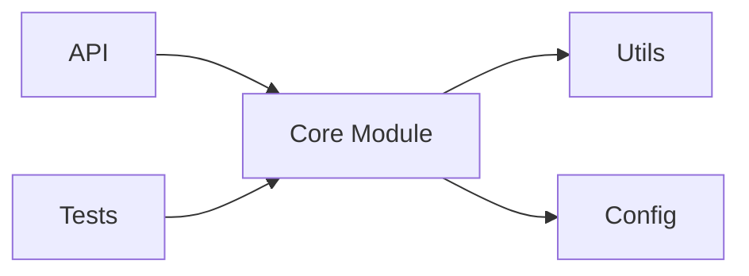
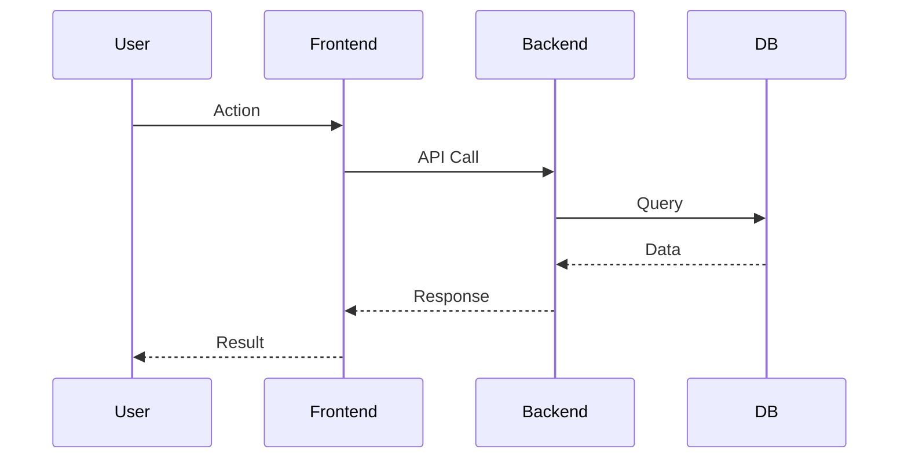

# Project Analyzer

This skill provides a systematic approach to analyzing open source projects with structured reporting and visual diagrams.

## When to Use This Skill

Use this skill when the user:

- Asks to "analyze" or "review" or "分析" an open source project
- Wants to understand the architecture of a GitHub repository
- Needs a detailed evaluation of a codebase
- Requests a project report or summary
- Mentions "I want to analyze [project name]"
- Asks for recommendations about a specific project

## Workflow Overview

The analysis follows a **12-step sequential process** with progress reporting:

1. **📋 项目基本信息** (Project Basic Info) - Basic metadata (stars, language, license)
2. **🏗️ 项目结构** (Project Structure) - Directory structure and module relationships
3. **🛠️ 技术栈** (Tech Stack) - Dependencies and frameworks
4. **🎯 核心功能** (Core Features) - Key features with sequence diagram
5. **🏛️ 架构设计** (Architecture Design) - Architecture patterns with diagrams
6. **📊 代码质量** (Code Quality) - Code style, testing, complexity
7. **📚 文档质量** (Documentation Quality) - README, API docs, guides
8. **📈 项目活跃度** (Project Activity) - Commits, issues, PRs
9. **✅ 优点/缺点** (Pros/Cons) - Strengths and weaknesses
10. **🎯 适用场景** (Use Cases) - When to use/not use
11. **💡 学习价值** (Learning Value) - What's worth learning
12. **📝 总结** (Summary) - Final verdict

## Advanced Deep-Dive Analysis Mode

For complex or technical projects, enable **深度分析模式** which adds:

13. **🔧 源码深度分析** (Source Code Deep Dive) - Key code paths, function call chains
14. **⚙️ 实现机制剖析** (Implementation Mechanics) - Internal mechanisms and data flows
15. **🔍 关键组件解析** (Component Analysis) - Deep dive into critical components
16. **📐 协议与接口分析** (Protocol & Interface Analysis) - API contracts and protocols
17. **🚀 工作流程追踪** (Workflow Tracing) - End-to-end flow analysis
18. **🛡️ 安全性分析** (Security Analysis) - Security mechanisms and vulnerabilities
19. **⚡ 性能分析** (Performance Analysis) - Performance bottlenecks and optimizations
20. **🧪 测试策略分析** (Testing Strategy) - Testing approaches and coverage

## Analysis Process

### Step 0: Preparation

1. **Read the template** from `~/.agents/skills/project-analyzer/TEMPLATE.md`
2. **Create analysis file** by copying template to `[project-name]-分析.md`
3. **Gather project info** using:
   - GitHub API: `gh api repos/owner/repo`
   - `gh repo view owner/repo --json description,stargazersCount,forksCount,primaryLanguage,licenseInfo`
   - Web fetch for README and documentation
   - Code structure exploration via `gh api` or `git clone`

### Step 1-N: Sequential Analysis (Progressive)

For **each of the 12 topics**:

1. **Analyze the topic** (collect info, create diagrams as needed)
2. **Create individual topic document** and save to workspace
3. **Update the main analysis file** with findings
4. **Report progress** to user with format:
   ```
   ✅ [Topic Name] 完成 (进度 X/12)

   [Key findings summary]

   📄 主题文档: [project-name]-[topic-name].md

   🔄 继续下一个主题...
   ```
5. **Automatically proceed** to next topic immediately (no user confirmation needed)

**重要**: 分析完一个主题后立即汇报，然后主动继续下一个主题，不要等待用户确认。

### Final Step: Complete

After finishing all 12 topics:

1. **Present summary** with key insights
2. **Show file location**: `/Users/ccc/.openclaw/workspace/[project-name]/ai-analysis-docs/[project-name]-分析.md`
3. **Offer follow-up** (e.g., "Want me to dive deeper into any specific area?")

## Information Gathering Strategy

### For Basic Info (Topic 1)
```bash
gh api repos/owner/repo
```

### For Project Structure (Topic 2)
```bash
gh api repos/owner/repo/git/trees/main?recursive=1
```

### For Tech Stack (Topic 3)
```bash
# Common dependency files
gh api repos/owner/repo/contents/package.json
gh api repos/owner/repo/requirements.txt
gh api repos/owner/repo/Cargo.toml
gh api repos/owner/repo/go.mod
```

### For Activity (Topic 8)
```bash
gh api repos/owner/repo/issues?state=open&per_page=10
gh api repos/owner/repo/pulls?state=open&per_page=10
gh api repos/owner/repo/stats/commit_activity
```

## Mermaid Diagram Guidelines

### Use these diagrams based on project type:

| Topic | Diagram Types | When to Use |
|-------|--------------|-------------|
| 项目结构 | Module graph | Always - show dependencies |
| 技术栈 | Dependency graph | Always - show stack layers |
| 核心功能 | Sequence diagram | When user flows are clear |
| 架构设计 | Architecture flowchart | Always - show layers |
| 架构设计 | Data flow diagram | When data flow is complex |
| 总结 | State diagram | For FSM/state-based projects |
| 总结 | ER diagram | For database-heavy projects |
| 总结 | Git graph | For projects with interesting branching |

### Example Module Graph:


### Example Sequence Diagram:


## Progress Reporting Format

Always report after completing each topic:

```
✅ [Topic Name] 完成 (进度 X/12)

[2-3 bullet points of key findings]

[Optional: Show a small preview of the section content]

继续下一个主题...
```

## Template Location

- **Analysis template**: `~/.agents/skills/project-analyzer/TEMPLATE.md`
- **Backup copy**: `/Users/ccc/.openclaw/workspace/项目分析模版.md` (kept for reference)
- **Output directory**: `/Users/ccc/.openclaw/workspace/[project-name]/ai-analysis-docs/`
- **Output naming**: `[project-name]-分析.md`

## Example Response Pattern

When user says "Analyze facebook/react":

```
开始分析 facebook/react 项目...

📋 正在收集项目信息...
📋 项目基本信息 完成 (进度 1/12)
- Stars: 230,000+
- Language: JavaScript
- License: MIT

继续下一个主题...

🏗️ 项目结构 完成 (进度 2/12)
- Main directories: packages/, fixtures/, scripts/
- Monorepo with 20+ packages

继续下一个主题...
[... continues through all 12 topics ...]

✅ 分析完成！
分析文件已保存: /Users/ccc/.openclaw/workspace/react-分析.md

想深入了解哪个部分吗？
```

## Important Notes

- **Always complete all 12 topics** - don't stop early unless user says "stop"
- **Report after each topic** - immediately inform user when each topic is done
- **Continue automatically** - proceed to next topic without waiting for user confirmation
- **Create individual topic documents** - each topic gets its own markdown file
- **Save incrementally** - create and save each topic document immediately after analysis
- **Update main document** - consolidate all findings into the main analysis file
- **Use mermaid diagrams** where appropriate - they add significant value
- **Be specific** - avoid generic comments, provide concrete details
- **Cite sources** - mention where info came from (GitHub, docs, etc.)
- **Template-driven** - follow the template structure closely

## Analysis Behavior Guidelines

### 当用户要求分析时：
1. **立即开始分析** - 不需要确认或询问
2. **逐个主题完成** - 每个主题完成后立即汇报
3. **主动继续** - 汇报后自动开始下一个主题
4. **完整完成** - 除非用户说"停止"，否则完成所有主题

### 汇报格式：
```
✅ [主题名称] 完成 (进度 X/12)

关键发现：
• 发现1
• 发现2
• 发现3

📄 主题文档: [文件路径]

🔄 继续下一个主题...
```

### 用户体验：
- 用户可以看到实时进度
- 每个主题完成都有明确反馈
- 不需要频繁交互，分析自动进行
- 用户可以随时说"停止"来中断分析

## Incremental Documentation Strategy

### File Organization

Each analysis generates multiple files:

```
[project-name]/
└── ai-analysis-docs/                 # All analysis documents in one place
    ├── [project-name]-分析.md       # Main consolidated report
    ├── [project-name]-进度追踪.md   # Progress tracking
    ├── analysis-todo.md             # Analysis TODO list
    ├── topics/                      # Individual topic documents
    │   ├── 01-项目基本信息.md
    │   ├── 02-项目结构.md
    │   ├── 03-技术栈.md
    │   ├── ...
    │   └── 20-测试策略分析.md       # For deep-dive mode
    └── assets/                      # Diagrams and images
        ├── architecture-diagram.md
        └── flowcharts/
```

### Topic Document Template

Each individual topic document follows this structure:

```markdown
# [Topic Name] - [Project Name]

## 📋 主题概览
- **分析主题**: [Topic Name]
- **项目**: [Project Name]
- **分析时间**: [Timestamp]
- **分析状态**: ✅ 已完成

## 🔍 分析内容

[Detailed analysis content for this specific topic]

## 📊 关键发现

- [Key finding 1]
- [Key finding 2]
- [Key finding 3]

## 🔗 相关资源

- 源码位置: [file:line]
- 参考文档: [links]
- 相关主题: [links to other topic documents]

---

*本文档由 project-analyzer skill 自动生成*
*生成时间: [timestamp]*
```

## Deep Code Analysis Methodology (Advanced)

When conducting source code deep dives, follow this systematic approach:

### Analysis Principles
1. **从架构到实现** (From Architecture to Implementation): Understand overall architecture first, then dive into code
2. **流程驱动** (Flow-Driven): Trace through actual workflows to understand code paths
3. **图文并茂** (Visual + Code): Combine Mermaid diagrams with code annotations
4. **可延续性** (Continuable): Provide guides for continued analysis
5. **实战导向** (Practice-Oriented): Include configuration examples and troubleshooting

### Code Analysis Structure
- **资源结构详解**: Source code locations, core type definitions, field explanations
- **工作原理**: Architecture diagrams, key mechanisms, data flow processes
- **源码深度分析**: Key code paths, function call chains, implementation details
- **实现对比**: Comparison of different implementations, pros/cons, use cases
- **配置和实践**: Configuration examples, best practices, performance optimization
- **监控和可观测性**: Metrics, logging, monitoring solutions
- **故障排查**: Common issues, troubleshooting steps, debugging commands

### Progressive Analysis Workflow
1. **Entry Point Analysis**: Identify main entry points (main functions, API endpoints)
2. **Data Structure Mapping**: Understand core data structures and their relationships
3. **Control Flow Tracing**: Follow execution paths through the codebase
4. **Dependency Analysis**: Map dependencies between modules and components
5. **Interface Analysis**: Understand API contracts and communication patterns
6. **State Management**: Analyze how state is managed and transitions occur
7. **Error Handling**: Review error handling and recovery mechanisms
8. **Extension Points**: Identify plugin systems, hooks, or extension mechanisms

## Related Skills

- `github` - For GitHub API access and repository data
- `pretty-mermaid` - For advanced Mermaid diagram rendering
- `coding-router` - For deeper code architecture analysis

## Analysis Triggers

### Standard Analysis Mode (12 steps)
Use when user asks for:
- "analyze [project]"
- "review [project]"
- "evaluate [project]"
- General project understanding

### Deep-Dive Mode (20 steps)
Use when user asks for:
- "deep dive into [project]"
- "source code analysis of [project]"
- "how does [project] work internally"
- "implementation details of [project]"
- Technical architecture evaluation
- Performance/security analysis requirements

### Quick Assessment Mode (6 steps)
Use when user asks for:
- "quick overview of [project]"
- "brief analysis of [project]"
- "should I use [project]"
- Basic project evaluation (steps 1,3,4,9,10,12 only)
