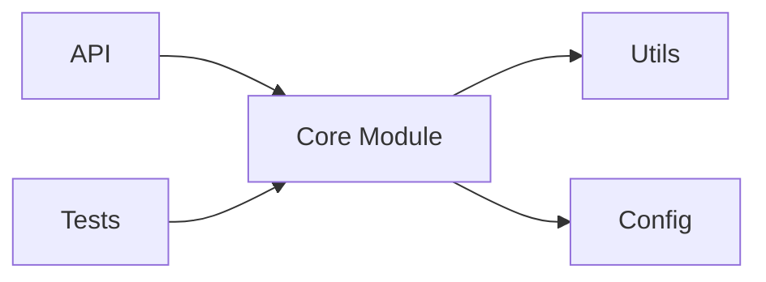
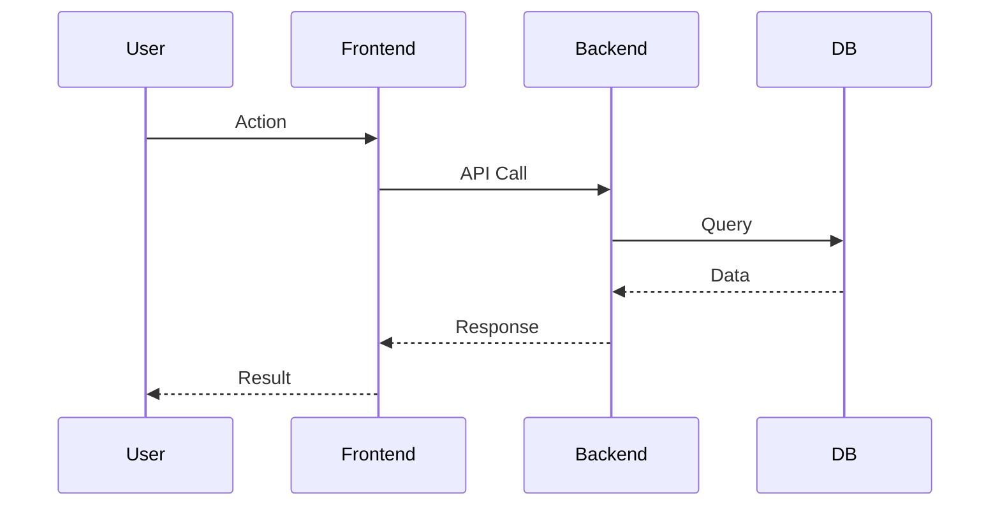

# Project Analyzer

This skill provides a systematic approach to analyzing projects with structured reporting and visual diagrams.

## When to Use This Skill

Use this skill when the user:

- Asks to "analyze", "review", or "evaluate" a project
- Wants to understand the architecture of a codebase
- Needs a detailed evaluation of a project (local or remote)
- Requests a project report or summary
- Mentions "I want to analyze [project name/path]"
- Asks for recommendations about a specific project

## Supported Project Types

**Local Projects** (Primary):
- Local directory paths: `~/work/my-project`
- Current directory: `.`
- Relative paths: `./my-project`
- Absolute paths: `/Users/ccc/work/todo/kubernetes`

**Remote Projects** (Optional):
- GitHub repositories: `owner/repo`
- Git URLs: `https://github.com/owner/repo`

## Workflow Overview

The analysis follows a **12-step sequential process** with progress reporting:

1. **📋 Project Basic Info** - Basic metadata (language, file count, structure)
2. **🏗️ Project Structure** - Directory structure and module relationships
3. **🛠️ Tech Stack** - Dependencies and frameworks
4. **🎯 Core Features** - Key features with sequence diagram
5. **🏛️ Architecture Design** - Architecture patterns with diagrams
6. **📊 Code Quality** - Code style, testing, complexity
7. **📚 Documentation Quality** - README, API docs, guides
8. **📈 Project Activity** - Commits, issues, PRs (from git if available)
9. **✅ Pros/Cons** - Strengths and weaknesses
10. **🎯 Use Cases** - When to use/not use
11. **💡 Learning Value** - What's worth learning
12. **📝 Summary** - Final verdict

## Advanced Deep-Dive Analysis Mode

For complex or technical projects, enable **Deep Analysis Mode** which adds:

13. **🔧 Source Code Deep Dive** - Key code paths, function call chains
14. **⚙️ Implementation Mechanics** - Internal mechanisms and data flows
15. **🔍 Component Analysis** - Deep dive into critical components
16. **📐 Protocol & Interface Analysis** - API contracts and protocols
17. **🚀 Workflow Tracing** - End-to-end flow analysis
18. **🛡️ Security Analysis** - Security mechanisms and vulnerabilities
19. **⚡ Performance Analysis** - Performance bottlenecks and optimizations
20. **🧪 Testing Strategy Analysis** - Testing approaches and coverage

## Analysis Process

### Step 0: Preparation

1. **Initialize Heartbeat Detection** - Create memory-based progress tracking
   - Write analysis start status to OpenClaw memory: `memory/YYYY-MM-DD.md`
   - Record current project path, analysis mode, and start timestamp
   - This prevents analysis interruption and enables resume capability
2. **Read the template** from `~/.agents/skills/project-analyzer/TEMPLATE.md`
3. **Create analysis directory** at `[project-path]/ai-analysis-docs/`
   - **Important**: Analysis documents are saved INSIDE the project being analyzed
   - Example: `/Users/ccc/work/todo/kubernetes/ai-analysis-docs/`
4. **Create TODO list** using the template from `CHANGELOG_TEMPLATE.md`
   - Create `analysis-todo.md` with all planned topics
   - Initialize all topics with "Not Started" status
   - Set estimated times and priorities for each topic
5. **Gather project info** using:

**For Local Projects** (Primary):
- File system analysis: directory structure, file counts
- README analysis: local README files
- Code analysis: local source code examination
- Configuration files: package.json, go.mod, Cargo.toml, etc.
- Build scripts: Makefile, build.sh, etc.

**For Remote Projects** (Optional):
- GitHub API: `gh api repos/owner/repo`
- `gh repo view owner/repo --json description,stargazersCount,forksCount,primaryLanguage,licenseInfo`
- Web fetch for README and documentation
- Code structure exploration via `gh api` or `git clone`

### Step 1-N: Sequential Analysis (Progressive)

For **each of the 12 topics**:

1. **Update Heartbeat** - Write progress to OpenClaw memory
   - Update `memory/YYYY-MM-DD.md` with current topic and progress
   - This ensures analysis can resume if interrupted
2. **Report starting** to user with format:
   ```
   🔵 [Topic Name] started (progress X/12)

   📋 Analysis scope: [brief description of what will be analyzed]
   🎯 Focus areas: [key aspects to investigate]

   🔄 Starting analysis...
   ```
3. **Update analysis-todo.md** - Mark current topic as "In Progress"
4. **Analyze the topic** (collect info, create diagrams as needed)
5. **Create individual topic document** and save to project's ai-analysis-docs directory
   - **🎉 File creation feedback**: Immediately report when file is created
   - Format: `📄 Created: [file-path]`
6. **Update the main analysis file** with findings
   - **📝 File update feedback**: Report when main file is updated
   - Format: `🔄 Updated: [main-analysis-file]`
7. **Update changelog.md** with document creation record
   - **📋 Changelog feedback**: Report changelog update
   - Format: `📋 Updated: changelog.md`
8. **Update analysis-todo.md** - Mark current topic as "Completed" and update progress statistics
   - **✅ Progress feedback**: Report progress update
   - Format: `📊 Updated: analysis-todo.md (progress X/12)`
9. **Update Heartbeat** - Write completion to memory and mark topic complete
10. **Report completion** to user with format:
   ```
   ✅ [Topic Name] completed (progress X/12)

   [Key findings summary]

   📁 Files created/updated:
   • Created: [topic-file-path]
   • Updated: [main-analysis-file]
   • Updated: changelog.md
   • Updated: analysis-todo.md

   🔄 Continuing to next topic...
   ```
11. **Automatically proceed** to next topic immediately (no user confirmation needed)

**Important**:
1. Always report when STARTING each topic analysis
2. Provide immediate file creation feedback
3. Report completion summary
4. Then automatically continue to the next topic without waiting for user confirmation

### Final Step: Complete

After finishing all 12 topics:

1. **Update Heartbeat** - Mark analysis as complete in memory
   - Write completion status to `memory/YYYY-MM-DD.md`
   - Clear active analysis flag to prevent resume attempts
2. **Present summary** with key insights
3. **Show file location**: `[project-path]/ai-analysis-docs/[project-name]-analysis.md`
   - Example: `/Users/ccc/work/todo/kubernetes/ai-analysis-docs/kubernetes-analysis.md`
4. **Offer follow-up** (e.g., "Want me to dive deeper into any specific area?")

## Information Gathering Strategy

### For Local Projects (Primary)

**For Basic Info (Topic 1)**:
```bash
# Directory analysis
ls -la [project-path]
find [project-path] -type f | wc -l
find [project-path] -name "README*" -o -name "readme*"

# Language detection
find [project-path] -name "*.go" | wc -l
find [project-path] -name "*.js" | wc -l
find [project-path] -name "*.py" | wc -l

# Configuration files
ls [project-path]/*.json [project-path]/*.mod [project-path]/*.toml
```

**For Project Structure (Topic 2)**:
```bash
# Directory tree
tree -L 3 [project-path]  # or: find [project-path] -type d | head -20

# File statistics
find [project-path] -type f -name "*.go" | head -10
find [project-path] -type f -name "*.md" | head -10

# Key directories
ls -la [project-path]/cmd/
ls -la [project-path]/pkg/
ls -la [project-path]/src/
```

**For Tech Stack (Topic 3)**:
```bash
# Check for dependency files
cat [project-path]/package.json
cat [project-path]/go.mod
cat [project-path]/requirements.txt
cat [project-path]/Cargo.toml

# Build tools
ls [project-path]/Makefile
ls [project-path]/build.sh
cat [project-path]/.github/workflows/*.yml
```

**For Activity (Topic 8)**:
```bash
# Git history (if available)
cd [project-path] && git log --oneline -10
git log --since="1 month ago" --oneline | wc -l
git log --since="1 year ago" --pretty=format:"%h %ad" --date=short | head -10
```

### For Remote Projects (Optional)

**For Basic Info (Topic 1)**:
```bash
gh api repos/owner/repo
```

**For Project Structure (Topic 2)**:
```bash
gh api repos/owner/repo/git/trees/main?recursive=1
```

**For Tech Stack (Topic 3)**:
```bash
# Common dependency files
gh api repos/owner/repo/contents/package.json
gh api repos/owner/repo/requirements.txt
gh api repos/owner/repo/Cargo.toml
gh api repos/owner/repo/go.mod
```

**For Activity (Topic 8)**:
```bash
gh api repos/owner/repo/issues?state=open&per_page=10
gh api repos/owner/repo/pulls?state=open&per_page=10
gh api repos/owner/repo/stats/commit_activity
```

## Mermaid Diagram Guidelines

### Use these diagrams based on project type:

| Topic | Diagram Types | When to Use |
|-------|--------------|-------------|
| Project Structure | Module graph | Always - show dependencies |
| Tech Stack | Dependency graph | Always - show stack layers |
| Core Features | Sequence diagram | When user flows are clear |
| Architecture Design | Architecture flowchart | Always - show layers |
| Architecture Design | Data flow diagram | When data flow is complex |
| Summary | State diagram | For FSM/state-based projects |
| Summary | ER diagram | For database-heavy projects |
| Summary | Git graph | For projects with interesting branching |

### Example Module Graph:


### Example Sequence Diagram:


## Progress Reporting Format

Always report after completing each topic:

```
✅ [Topic Name] completed (progress X/12)

[2-3 bullet points of key findings]

[Optional: Show a small preview of the section content]

📁 Files created/updated:
• Created: [specific-file-path]
• Updated: [specific-file-path]
• Updated: changelog.md
• Updated: analysis-todo.md (progress X/12)

🔄 Continuing to next topic...
```

**CRITICAL**: Every topic completion MUST include explicit file operation feedback showing exactly which files were created and updated.

## Template and Guide Locations

- **Analysis template**: `~/.agents/skills/project-analyzer/TEMPLATE.md`
- **Changelog template**: `~/.agents/skills/project-analyzer/CHANGELOG_TEMPLATE.md`
- **Progressive workflow guide**: `~/.agents/skills/project-analyzer/WORKFLOW.md`
- **Documentation guidelines**: `~/.agents/skills/project-analyzer/DOCUMENTATION_GUIDELINES.md`
- **Path storage guide**: `~/.agents/skills/project-analyzer/PATH_GUIDE.md`
- **Usage examples**: `~/.agents/skills/project-analyzer/EXAMPLE_WORKFLOW.md`
- **Output directory**: `[project-path]/ai-analysis-docs/` (INSIDE the analyzed project)
- **Output naming**: `[project-name]-analysis.md`

## Important: Document Location

**Analysis documents are ALWAYS saved in the analyzed project directory:**
```
[project-path]/ai-analysis-docs/
├── changelog.md
├── [project-name]-analysis.md
├── [project-name]-progress-tracking.md
├── analysis-todo.md
├── topics/
└── assets/
```

**Examples:**
- Analyzing `/Users/ccc/work/todo/kubernetes` → Documents saved in `/Users/ccc/work/todo/kubernetes/ai-analysis-docs/`
- Analyzing `/Users/ccc/work/my-project` → Documents saved in `/Users/ccc/work/my-project/ai-analysis-docs/`
- Analyzing `.` (current directory) → Documents saved in `./ai-analysis-docs/`

## Example Response Pattern

When user says "Analyze /Users/ccc/work/todo/kubernetes":

```
Starting analysis of /Users/ccc/work/todo/kubernetes project...

🔵 Project Basic Info started (progress 1/12)
📋 Analysis scope: Project metadata, language statistics, file structure overview
🎯 Focus areas: Primary language, file counts, project path, README analysis
🔄 Starting analysis...

📋 Project Basic Info completed (progress 1/12)
- Main language: Go (95%+)
- Total files: 50,000+
- Project path: /Users/ccc/work/todo/kubernetes

📁 Files created/updated:
• Created: /Users/ccc/work/todo/kubernetes/ai-analysis-docs/topics/01-project-basic-info.md
• Updated: /Users/ccc/work/todo/kubernetes/ai-analysis-docs/kubernetes-analysis.md
• Updated: /Users/ccc/work/todo/kubernetes/ai-analysis-docs/changelog.md
• Updated: /Users/ccc/work/todo/kubernetes/ai-analysis-docs/analysis-todo.md (progress 1/12)

🔄 Continuing to next topic...

🔵 Project Structure started (progress 2/12)
📋 Analysis scope: Directory organization, module relationships, component layout
🎯 Focus areas: Main directories, core components, file distribution patterns
🔄 Starting analysis...

🏗️ Project Structure completed (progress 2/12)
- Main directories: cmd/, pkg/, staging/
- Core components: kube-apiserver, kubelet, kube-proxy

📁 Files created/updated:
• Created: /Users/ccc/work/todo/kubernetes/ai-analysis-docs/topics/02-project-structure.md
• Updated: /Users/ccc/work/todo/kubernetes/ai-analysis-docs/kubernetes-analysis.md
• Updated: /Users/ccc/work/todo/kubernetes/ai-analysis-docs/changelog.md
• Updated: /Users/ccc/work/todo/kubernetes/ai-analysis-docs/analysis-todo.md (progress 2/12)

🔄 Continuing to next topic...
[... continues through all 12 topics ...]

✅ Analysis completed!
Analysis documents saved: /Users/ccc/work/todo/kubernetes/ai-analysis-docs/kubernetes-analysis.md

Would you like to dive deeper into any specific area?
```

## Important Notes

- **Always complete all 12 topics** - don't stop early unless user says "stop"
- **🔵 Report STARTING each topic** - always inform user when beginning each topic analysis
- **Report after each topic** - immediately inform user when each topic is done
- **Continue automatically** - proceed to next topic without waiting for user confirmation
- **Create individual topic documents** - each topic gets its own markdown file
- **Save incrementally** - create and save each topic document immediately after analysis
- **Update main document** - consolidate all findings into the main analysis file
- **🎉 CRITICAL: File operation feedback** - ALWAYS report every file creation and update operation
- **Detailed file tracking** - distinguish between "Created" (new files) and "Updated" (modified files)
- **Use mermaid diagrams** where appropriate - they add significant value
- **Be specific** - avoid generic comments, provide concrete details
- **Cite sources** - mention where info came from (GitHub, docs, etc.)
- **Template-driven** - follow the template structure closely

## Analysis Behavior Guidelines

### When user requests analysis:
1. **Start immediately** - no confirmation or questions needed
2. **Complete topic by topic** - report after each topic completion
3. **Continue automatically** - automatically start next topic after reporting
4. **Complete fully** - finish all topics unless user says "stop"

### Reporting Format:
```
✅ [Topic Name] completed (progress X/12)

Key findings:
• Finding 1
• Finding 2
• Finding 3

📁 Files created/updated:
• Created: [topic-document-path]
• Updated: [main-analysis-file]
• Updated: changelog.md
• Updated: analysis-todo.md (progress X/12)

🔄 Continuing to next topic...
```

### User Experience:
- Users can see real-time progress
- **Clear feedback when STARTING each topic** - users know what's being analyzed next
- Clear feedback after each topic completion
- **Immediate file creation feedback** - users know exactly when files are created
- Detailed file operation tracking (created vs updated)
- No frequent interaction needed, analysis proceeds automatically
- Users can say "stop" at any time to interrupt the analysis
- Complete audit trail of all file operations

## Incremental Documentation Strategy

### File Organization

Each analysis generates multiple files:

```
[project-name]/
└── ai-analysis-docs/                 # All analysis documents in one place
    ├── analysis-todo.md             # Analysis TODO list (created in Step 0)
    ├── changelog.md                 # Analysis changelog (updated throughout)
    ├── [project-name]-analysis.md   # Main consolidated report
    ├── [project-name]-progress-tracking.md   # Progress tracking
    ├── topics/                      # Individual topic documents
    │   ├── 01-project-basic-info.md
    │   ├── 02-project-structure.md
    │   ├── 03-tech-stack.md
    │   ├── ...
    │   └── 20-testing-strategy-analysis.md   # For deep-dive mode
    └── assets/                      # Diagrams and images
        ├── architecture-diagram.md
        └── flowcharts/
```

### Topic Document Template

Each individual topic document follows this structure:

```markdown
# [Topic Name] - [Project Name]

## 📋 Topic Overview
- **Analysis Topic**: [Topic Name]
- **Project**: [Project Name]
- **Analysis Time**: [Timestamp]
- **Analysis Status**: ✅ Completed

## 🔍 Analysis Content

[Detailed analysis content for this specific topic]

## 📊 Key Findings

- [Key finding 1]
- [Key finding 2]
- [Key finding 3]

## 🔗 Related Resources

- Source location: [file:line]
- Reference docs: [links]
- Related topics: [links to other topic documents]

---

*This document was auto-generated by project-analyzer skill*
*Generated at: [timestamp]*
```

## Deep Code Analysis Methodology (Advanced)

When conducting source code deep dives, follow this systematic approach:

### Analysis Principles
1. **From Architecture to Implementation**: Understand overall architecture first, then dive into code
2. **Flow-Driven**: Trace through actual workflows to understand code paths
3. **Visual + Code**: Combine Mermaid diagrams with code annotations
4. **Continuable**: Provide guides for continued analysis
5. **Practice-Oriented**: Include configuration examples and troubleshooting

### Code Analysis Structure
- **Resource Structure Details**: Source code locations, core type definitions, field explanations
- **Working Principles**: Architecture diagrams, key mechanisms, data flow processes
- **Source Code Deep Analysis**: Key code paths, function call chains, implementation details
- **Implementation Comparison**: Comparison of different implementations, pros/cons, use cases
- **Configuration and Practice**: Configuration examples, best practices, performance optimization
- **Monitoring and Observability**: Metrics, logging, monitoring solutions
- **Troubleshooting**: Common issues, troubleshooting steps, debugging commands

### Progressive Analysis Workflow
1. **Entry Point Analysis**: Identify main entry points (main functions, API endpoints)
2. **Data Structure Mapping**: Understand core data structures and their relationships
3. **Control Flow Tracing**: Follow execution paths through the codebase
4. **Dependency Analysis**: Map dependencies between modules and components
5. **Interface Analysis**: Understand API contracts and communication patterns
6. **State Management**: Analyze how state is managed and transitions occur
7. **Error Handling**: Review error handling and recovery mechanisms
8. **Extension Points**: Identify plugin systems, hooks, or extension mechanisms

## Analysis Triggers

### Standard Analysis Mode (12 steps)
Use when user asks for:
- "analyze [project]"
- "review [project]"
- "evaluate [project]"
- General project understanding

### Deep-Dive Mode (20 steps)
Use when user asks for:
- "deep dive into [project]"
- "source code analysis of [project]"
- "how does [project] work internally"
- "implementation details of [project]"
- Technical architecture evaluation
- Performance/security analysis requirements

### Quick Assessment Mode (6 steps)
Use when user asks for:
- "quick overview of [project]"
- "brief analysis of [project]"
- "should I use [project]"
- Basic project evaluation (steps 1,3,4,9,10,12 only)

## Related Skills and Resources

### Related Skills
- `github` - For GitHub API access and repository data
- `pretty-mermaid` - For advanced Mermaid diagram rendering
- `coding-router` - For deeper code architecture analysis

### Supporting Documentation
- `WORKFLOW.md` - Progressive analysis methodology and deep-dive workflows
- `DOCUMENTATION_GUIDELINES.md` - File organization standards and naming conventions
- `PATH_GUIDE.md` - Path storage rules and best practices
- `EXAMPLE_WORKFLOW.md` - Complete usage examples with Kubernetes project
- `INTEGRATION_SUMMARY.md` - Kubernetes analysis methodology integration details