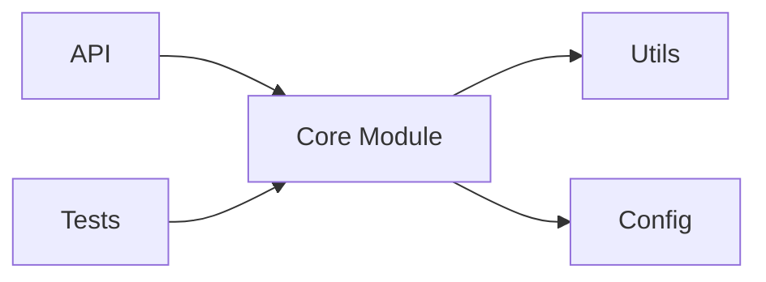
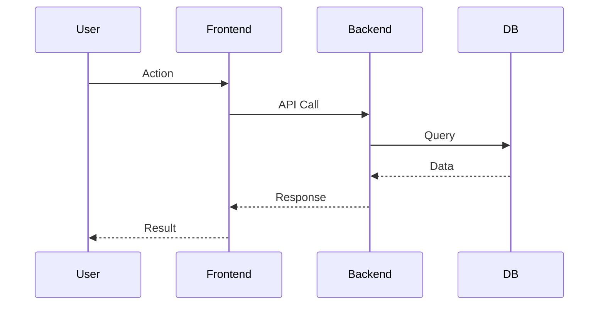

# Project Analyzer

This skill provides a systematic approach to analyzing open source projects with structured reporting and visual diagrams.

## When to Use This Skill

Use this skill when the user:

- Asks to "analyze" or "review" or "分析" an open source project
- Wants to understand the architecture of a GitHub repository
- Needs a detailed evaluation of a codebase
- Requests a project report or summary
- Mentions "I want to analyze [project name]"
- Asks for recommendations about a specific project

## Workflow Overview

The analysis follows a **12-step sequential process** with progress reporting:

1. **📋 项目基本信息** (Project Basic Info) - Basic metadata (stars, language, license)
2. **🏗️ 项目结构** (Project Structure) - Directory structure and module relationships
3. **🛠️ 技术栈** (Tech Stack) - Dependencies and frameworks
4. **🎯 核心功能** (Core Features) - Key features with sequence diagram
5. **🏛️ 架构设计** (Architecture Design) - Architecture patterns with diagrams
6. **📊 代码质量** (Code Quality) - Code style, testing, complexity
7. **📚 文档质量** (Documentation Quality) - README, API docs, guides
8. **📈 项目活跃度** (Project Activity) - Commits, issues, PRs
9. **✅ 优点/缺点** (Pros/Cons) - Strengths and weaknesses
10. **🎯 适用场景** (Use Cases) - When to use/not use
11. **💡 学习价值** (Learning Value) - What's worth learning
12. **📝 总结** (Summary) - Final verdict

## Analysis Process

### Step 0: Preparation

1. **Read the template** from `~/.agents/skills/project-analyzer/TEMPLATE.md`
2. **Create analysis file** by copying template to `[project-name]-分析.md`
3. **Gather project info** using:
   - GitHub API: `gh api repos/owner/repo`
   - `gh repo view owner/repo --json description,stargazersCount,forksCount,primaryLanguage,licenseInfo`
   - Web fetch for README and documentation
   - Code structure exploration via `gh api` or `git clone`

### Step 1-N: Sequential Analysis (Progressive)

For **each of the 12 topics**:

1. **Analyze the topic** (collect info, create diagrams as needed)
2. **Update the analysis file** with findings
3. **Report progress** to user with format:
   ```
   ✅ [Topic Name] 完成 (进度 X/12)

   [Key findings summary]
   ```
4. **Automatically proceed** to next topic (no user confirmation needed)

### Final Step: Complete

After finishing all 12 topics:

1. **Present summary** with key insights
2. **Show file location**: `/Users/ccc/.openclaw/workspace/[project-name]-分析.md`
3. **Offer follow-up** (e.g., "Want me to dive deeper into any specific area?")

## Information Gathering Strategy

### For Basic Info (Topic 1)
```bash
gh api repos/owner/repo
```

### For Project Structure (Topic 2)
```bash
gh api repos/owner/repo/git/trees/main?recursive=1
```

### For Tech Stack (Topic 3)
```bash
# Common dependency files
gh api repos/owner/repo/contents/package.json
gh api repos/owner/repo/requirements.txt
gh api repos/owner/repo/Cargo.toml
gh api repos/owner/repo/go.mod
```

### For Activity (Topic 8)
```bash
gh api repos/owner/repo/issues?state=open&per_page=10
gh api repos/owner/repo/pulls?state=open&per_page=10
gh api repos/owner/repo/stats/commit_activity
```

## Mermaid Diagram Guidelines

### Use these diagrams based on project type:

| Topic | Diagram Types | When to Use |
|-------|--------------|-------------|
| 项目结构 | Module graph | Always - show dependencies |
| 技术栈 | Dependency graph | Always - show stack layers |
| 核心功能 | Sequence diagram | When user flows are clear |
| 架构设计 | Architecture flowchart | Always - show layers |
| 架构设计 | Data flow diagram | When data flow is complex |
| 总结 | State diagram | For FSM/state-based projects |
| 总结 | ER diagram | For database-heavy projects |
| 总结 | Git graph | For projects with interesting branching |

### Example Module Graph:


### Example Sequence Diagram:


## Progress Reporting Format

Always report after completing each topic:

```
✅ [Topic Name] 完成 (进度 X/12)

[2-3 bullet points of key findings]

[Optional: Show a small preview of the section content]

继续下一个主题...
```

## Template Location

- **Analysis template**: `~/.agents/skills/project-analyzer/TEMPLATE.md`
- **Backup copy**: `/Users/ccc/.openclaw/workspace/项目分析模版.md` (kept for reference)
- **Output directory**: `/Users/ccc/.openclaw/workspace/`
- **Output naming**: `[project-name]-分析.md`

## Example Response Pattern

When user says "Analyze facebook/react":

```
开始分析 facebook/react 项目...

📋 正在收集项目信息...
📋 项目基本信息 完成 (进度 1/12)
- Stars: 230,000+
- Language: JavaScript
- License: MIT

继续下一个主题...

🏗️ 项目结构 完成 (进度 2/12)
- Main directories: packages/, fixtures/, scripts/
- Monorepo with 20+ packages

继续下一个主题...
[... continues through all 12 topics ...]

✅ 分析完成！
分析文件已保存: /Users/ccc/.openclaw/workspace/react-分析.md

想深入了解哪个部分吗？
```

## Important Notes

- **Always complete all 12 topics** - don't stop early unless user says "stop"
- **Save after each topic** - incremental saves prevent data loss
- **Use mermaid diagrams** where appropriate - they add significant value
- **Be specific** - avoid generic comments, provide concrete details
- **Cite sources** - mention where info came from (GitHub, docs, etc.)
- **Template-driven** - follow the template structure closely

## Related Skills

- `github` - For GitHub API access and repository data
- `pretty-mermaid` - For advanced Mermaid diagram rendering
- `coding-router` - For deeper code architecture analysis
