# Open Source Project Analysis Template

> Usage Instructions: Copy this file, name it `[project-name]-analysis.md`, and fill in the relevant content.

---

## 📋 Project Basic Information

| Project | Content |
|---------|---------|
| **Name** | |
| **Project Path** | |
| **Project Type** | Local Project / Remote Repository |
| **Primary Language** | |
| **Total Files** | |
| **Lines of Code** | |
| **Description** | |
| **License** | |
| **Analysis Date** | {{date}} |

---

## 🏗️ Project Structure

```
├── [Directory structure]
└── ...
```

**Key Directory Description:**

### Module Relationship Diagram

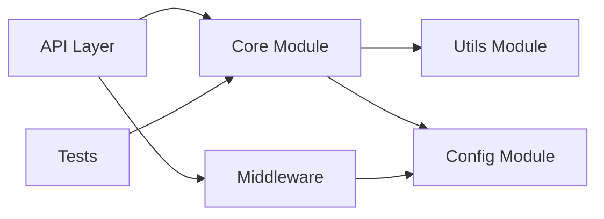

---

## 🛠️ Tech Stack

- **Primary Languages:**
- **Frameworks/Libraries:**
- **Build Tools:**
- **Testing Frameworks:**
- **CI/CD:**
- **Other Dependencies:**

### Dependency Diagram

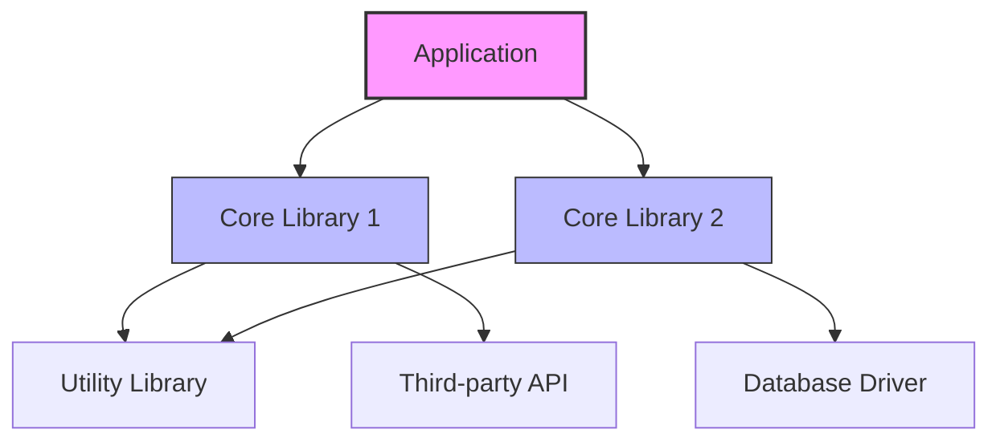

---

## 🎯 Core Features

1. [Feature 1]
2. [Feature 2]
3. [Feature 3]
4. ...

### Core Process Sequence Diagram

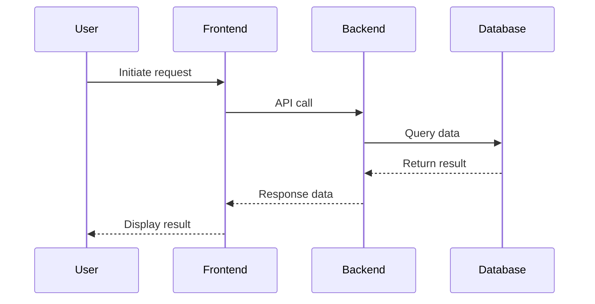

---

## 🏛️ Architecture Design

### Architecture Pattern
- [ ] MVC
- [ ] Microservices
- [ ] Layered Architecture
- [ ] Event-Driven
- [ ] Other: ___

### Architecture Diagram

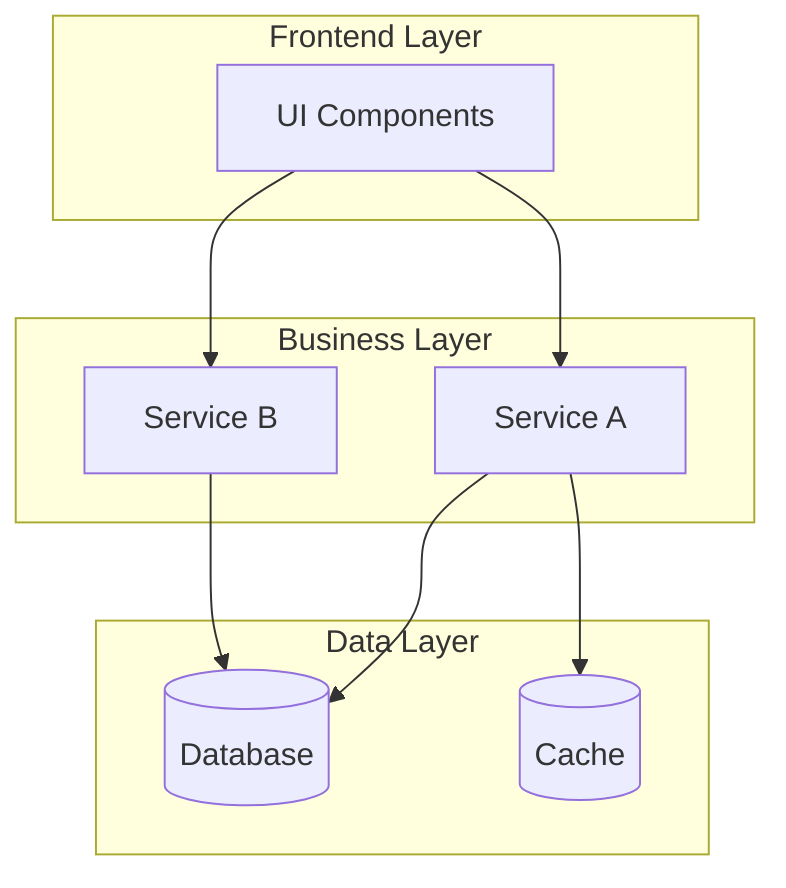

### Key Modules
| Module | Responsibility | Dependencies |
|--------|---------------|--------------|
| | | |

### Data Flow

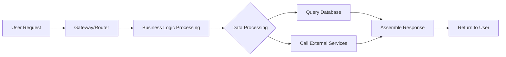

---

## 📊 Code Quality

### Code Style
- Lint configuration:
- Code style consistency:
- Naming conventions:

### Test Coverage
- Unit tests:
- Integration tests:
- E2E tests:
- Test coverage (if available):

### Code Complexity
- Code conciseness:
- Overly long functions/classes:
- Code smells (e.g., code duplication, magic numbers, etc.):

---

## 📚 Documentation Quality

| Type | Rating (1-5) | Description |
|------|-------------|-------------|
| README | ⭐⭐⭐⭐⭐ | |
| API Documentation | ⭐⭐⭐⭐⭐ | |
| Contributing Guide | ⭐⭐⭐⭐⭐ | |
| Architecture Documentation | ⭐⭐⭐⭐⭐ | |
| Example Code | ⭐⭐⭐⭐⭐ | |

**Documentation Highlights:**
- [ ] Clear installation steps
- [ ] Quick start examples
- [ ] Architecture diagrams/flowcharts
- [ ] FAQ section
- [ ] Changelog (CHANGELOG)

---

## 📈 Project Activity

### Git History (if available)
- Commits in last month: ___
- Commits in last 3 months: ___
- Number of main contributors: ___
- First commit date: ___

### Local Development Activity
- Code update frequency: ___
- Testing activity: ___
- Documentation updates: ___

### Project Maturity
- Project age: ___
- Major versions: ___
- Development stage: ___

---

## ✅ Strengths

1. [Strength 1]
2. [Strength 2]
3. [Strength 3]

---

## ⚠️ Weaknesses / Areas for Improvement

1. [Weakness 1]
2. [Weakness 2]
3. [Weakness 3]

---

## 🎯 Use Cases

- Suitable for:
  - ___
  - ___
- Not suitable for:
  - ___
  - ___

---

## 💡 Learning Value

**Worth Learning:**
- [ ] Architecture design approach
- [ ] Code organization
- [ ] Specific implementation
- [ ] Testing strategy
- [ ] Documentation writing

**Recommended Reading Order:**
1. ___
2. ___
3. ___

---

## 🔗 Reference Resources

- Official documentation: ___
- Tutorials/Articles: ___
- Video tutorials: ___
- Community discussions: ___

---

## 📝 Summary

### Deep Analysis Section (Optional - For technical in-depth analysis)

> Note: The following sections are applicable for technical projects requiring source code-level analysis

---

## 🔧 Source Code Deep Dive

### Core Code Paths

| Module/Function | Source Location | Key Files/Functions | Description |
|----------------|----------------|-------------------|-------------|
| | | | |

### Core Data Structures

```go
// Example: Core data structure definition
type CoreStruct struct {
    Field1 Type
    Field2 Type
}
```

### Key Function Call Chains

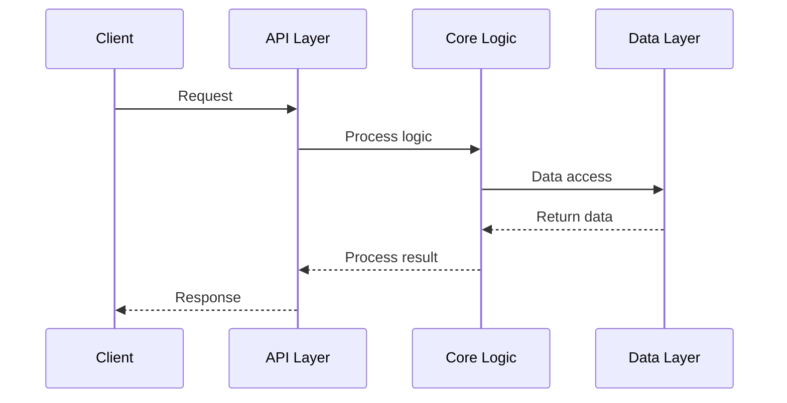

---

## ⚙️ Implementation Mechanics Analysis

### Core Mechanism Analysis

#### Mechanism 1: [Mechanism Name]

**Working Principle:**
- [Principle point 1]
- [Principle point 2]
- [Principle point 3]

**Implementation Process:**

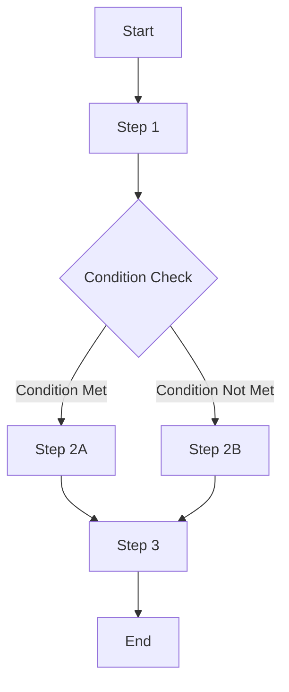

**Key Code Snippets:**

```
// Key implementation code
function keyImplementation() {
    // Core logic
}
```

#### Mechanism 2: [Mechanism Name]

[Repeat above structure]

---

## 🔍 Key Component Analysis

### Component Architecture Diagram

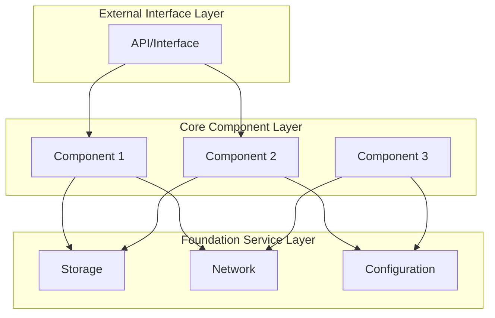

### Detailed Component Analysis

#### Component 1: [Component Name]

**Responsibilities:**
- [Responsibility 1]
- [Responsibility 2]

**Dependencies:**
- Depends on: [Component/Module]
- Required by: [Component/Module]

**Key Implementation:**
- File location: `path/to/file`
- Core function: `functionName()`

---

## 📐 Protocol & Interface Analysis

### API Interface Specifications

| Interface | Method | Path | Description |
|----------|--------|------|-------------|
| | | | |

### Communication Protocols

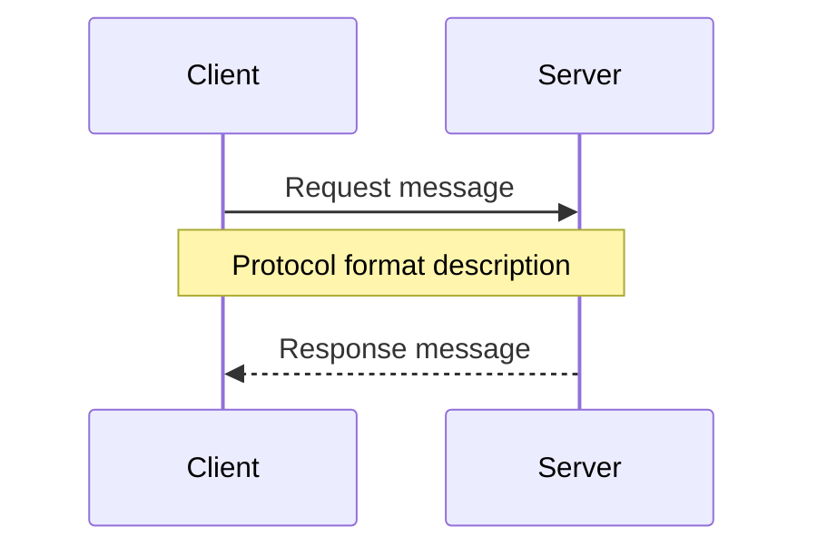

### Data Formats

```json
// Example: JSON data format
{
  "field1": "value1",
  "field2": "value2"
}
```

---

## 🚀 Workflow Tracing

### End-to-End Process Analysis

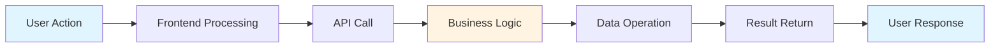

### Key Path Tracing

1. **Entry Point**: `[file:line]` - Function `main()` or `handler()`
2. **Processing Flow**:
   - Step 1: `[file:line]` - Function `step1()`
   - Step 2: `[file:line]` - Function `step2()`
   - Step 3: `[file:line]` - Function `step3()`
3. **Exit Point**: `[file:line]` - Return result

---

## 🛡️ Security Analysis

### Security Mechanisms

| Mechanism Type | Implementation | Protection Scope | Assessment |
|---------------|----------------|------------------|------------|
| Authentication | | | |
| Authorization | | | |
| Data Encryption | | | |
| Input Validation | | | |

### Potential Security Risks

- [ ] Risk 1: [Description]
- [ ] Risk 2: [Description]
- [ ] Risk 3: [Description]

### Security Best Practices

- [ ] [Practice 1]
- [ ] [Practice 2]
- [ ] [Practice 3]

---

## ⚡ Performance Analysis

### Performance Characteristics

| Metric | Performance | Bottleneck | Optimization Potential |
|--------|-------------|------------|----------------------|
| Response Time | | | |
| Throughput | | | |
| Resource Consumption | | | |
| Concurrency Capacity | | | |

### Performance Optimization Mechanisms

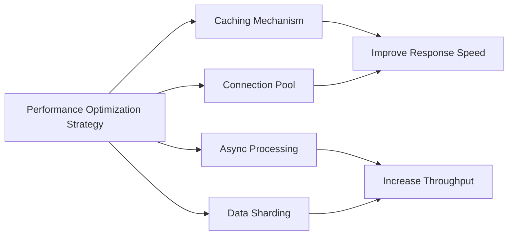

### Performance Bottlenecks

1. **Bottleneck 1**: [Description] - Location: `[file:line]`
2. **Bottleneck 2**: [Description] - Location: `[file:line]`
3. **Optimization Suggestions**: [Suggestions]

---

## 🧪 Testing Strategy Analysis

### Test Coverage

| Test Type | Coverage Scope | Tools/Frameworks | Assessment |
|----------|----------------|------------------|------------|
| Unit Tests | | | |
| Integration Tests | | | |
| End-to-End Tests | | | |
| Performance Tests | | | |
| Security Tests | | | |

### Testing Architecture

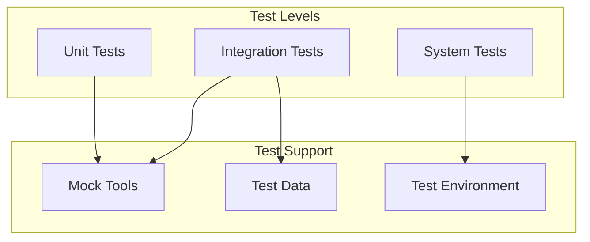

### Key Test Scenarios

- **Scenario 1**: [Description]
  - Test case: `path/to/test_file`
  - Covered function: `functionName()`

- **Scenario 2**: [Description]
  - Test case: `path/to/test_file`
  - Covered function: `functionName()`

---

## 🔧 Practical Configuration Examples

### Configuration File Examples

```yaml
# Example configuration
key1: value1
key2: value2
section:
  item1: value3
```

### Deployment Architecture

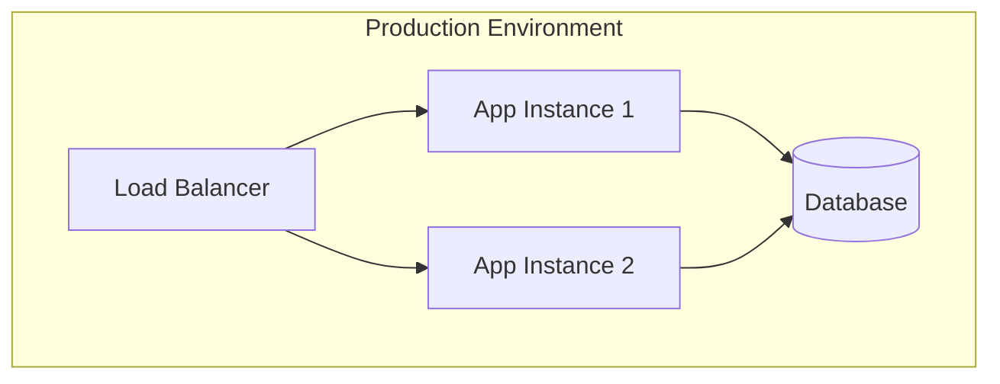

---

## 🚨 Troubleshooting Guide

### Common Issues

| Issue | Symptoms | Cause | Solution |
|-------|----------|-------|----------|
| | | | |

### Debugging Commands

```bash
# Example debugging commands
command1 --option
command2 --debug
```

### Log Analysis

- Log location: `path/to/logs`
- Key log format: [Example format]
- Log level configuration: [Configuration description]

---

### Summary Update Section

### Optional Supplementary Diagrams

#### State Transition Diagram (if applicable)

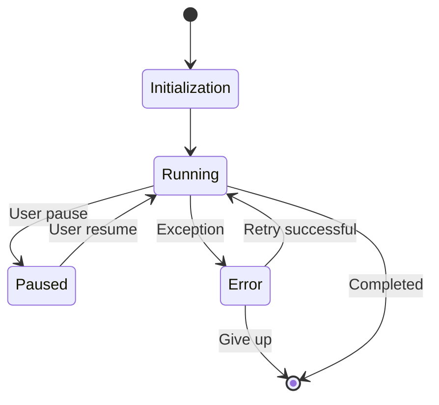

#### Database ER Diagram (if applicable)

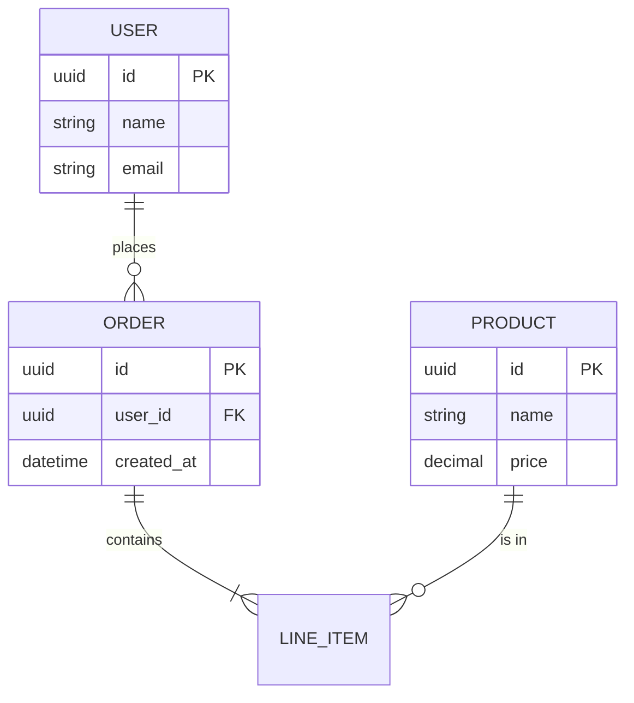

#### Git Branching Strategy (if applicable)


**One-sentence evaluation:**

**Recommendation:** ⭐⭐⭐⭐⭐ / 5

**Usage recommendations:**

---

*Template creation time: 2026-03-09*