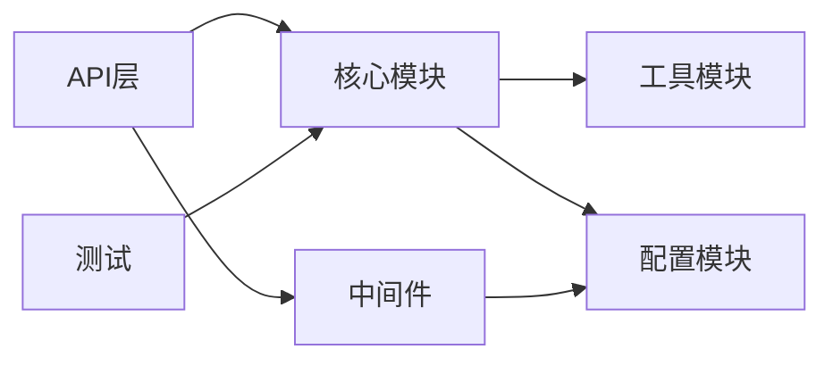
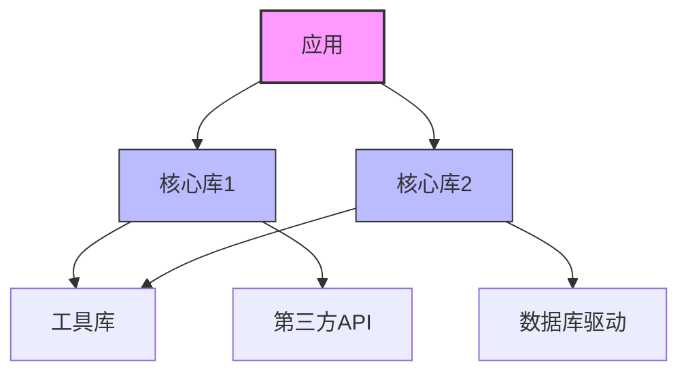
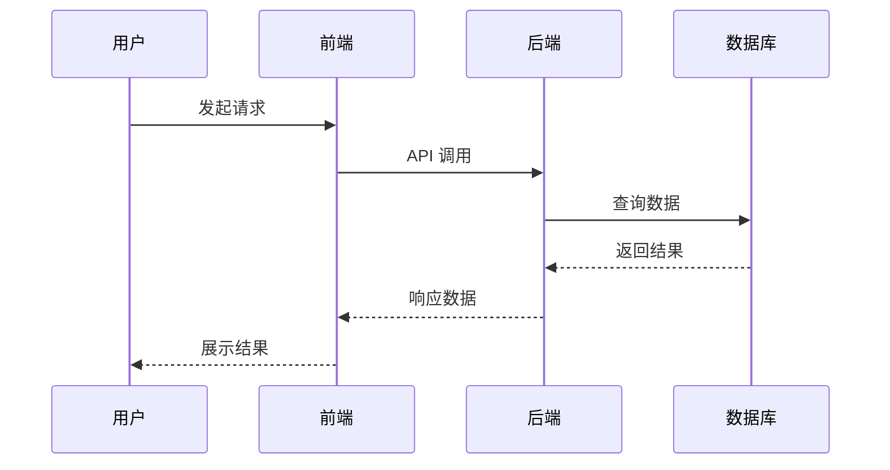
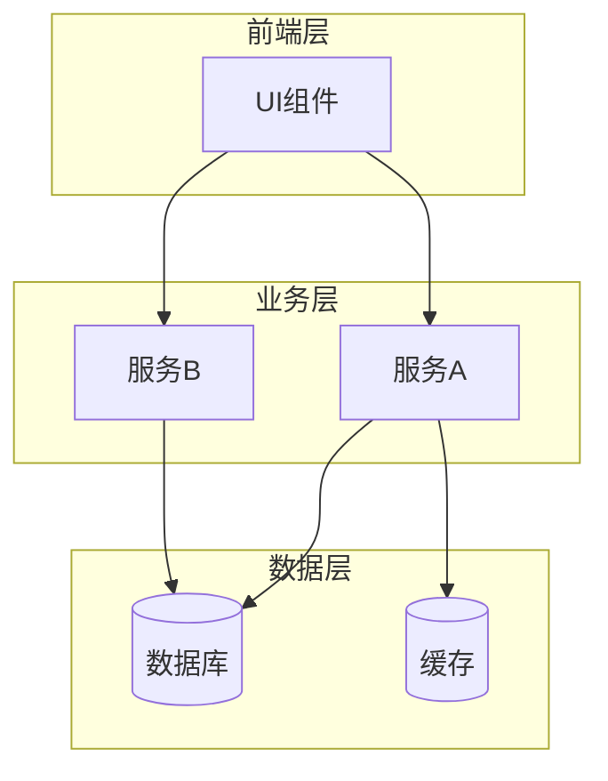
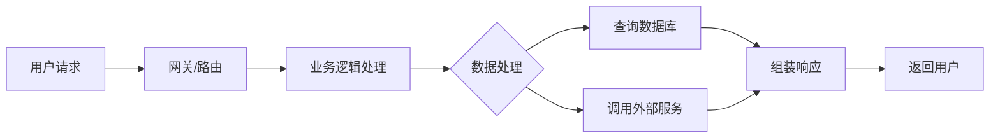
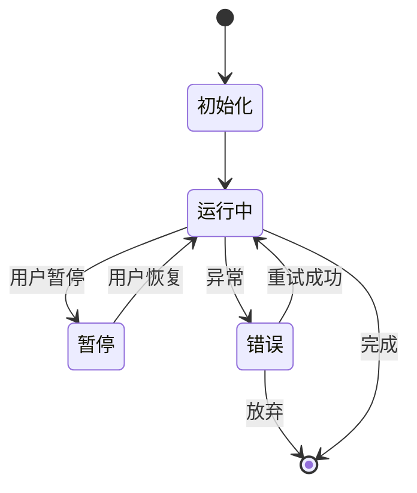
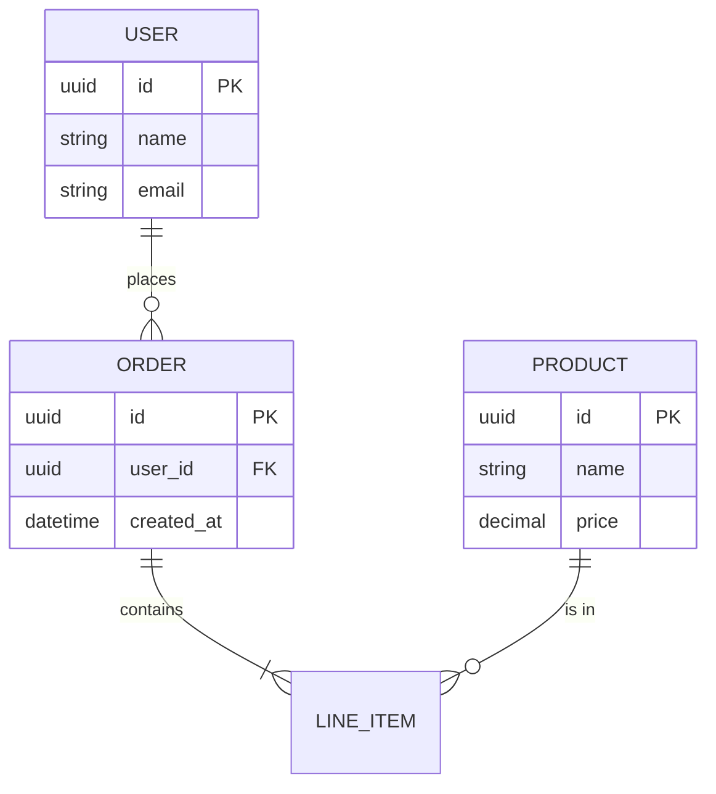
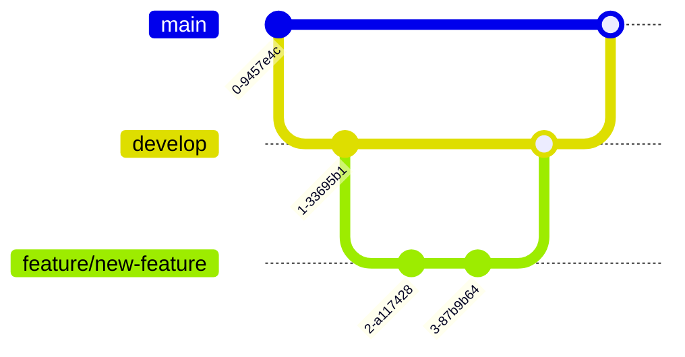

# 开源项目分析模版

> 使用说明：复制本文件，命名为 `[项目名]-分析.md`，填写相关内容。

---

## 📋 项目基本信息

| 项目 | 内容 |
|------|------|
| **名称** | |
| **仓库地址** | |
| **语言** | |
| **Stars** | |
| **Forks** | |
| **描述** | |
| **许可证** | |
| **分析日期** | {{date}} |

---

## 🏗️ 项目结构

```
├── [目录结构]
└── ...
```

**关键目录说明：**

### 模块关系图



---

## 🛠️ 技术栈

- **主要语言：**
- **框架/库：**
- **构建工具：**
- **测试框架：**
- **CI/CD：**
- **其他依赖：**

### 依赖关系图



---

## 🎯 核心功能

1. [功能1]
2. [功能2]
3. [功能3]
4. ...

### 核心流程时序图



---

## 🏛️ 架构设计

### 架构模式
- [ ] MVC
- [ ] 微服务
- [ ] 分层架构
- [ ] 事件驱动
- [ ] 其他：___

### 架构图



### 关键模块
| 模块 | 职责 | 依赖关系 |
|------|------|----------|
| | | |

### 数据流



---

## 📊 代码质量

### 代码风格
- 是否有 lint 配置：
- 代码风格一致性：
- 命名规范：

### 测试覆盖
- 单元测试：
- 集成测试：
- E2E 测试：
- 测试覆盖率（如有）：

### 代码复杂度
- 代码是否简洁：
- 是否有过长函数/类：
- 是否有坏味道（如代码重复、魔法数字等）：

---

## 📚 文档质量

| 类型 | 评分 (1-5) | 说明 |
|------|-----------|------|
| README | ⭐⭐⭐⭐⭐ | |
| API 文档 | ⭐⭐⭐⭐⭐ | |
| 贡献指南 | ⭐⭐⭐⭐⭐ | |
| 架构文档 | ⭐⭐⭐⭐⭐ | |
| 示例代码 | ⭐⭐⭐⭐⭐ | |

**文档亮点：**
- [ ] 安装步骤清晰
- [ ] 快速上手示例
- [ ] 架构图/流程图
- [ ] FAQ 部分
- [ ] 更新日志 (CHANGELOG)

---

## 📈 项目活跃度

### 提交记录
- 最近一个月提交数：___
- 最近三个月提交数：___
- 主要贡献者数量：___

### Issues
- Open Issues：___
- Closed Issues：___
- Issue 响应速度：___

### Pull Requests
- Open PRs：___
- Merged PRs：___
- PR 合并速度：___

### 发布节奏
- 最近版本：v___
- 发布周期：___
- 是否遵循语义化版本：___

---

## ✅ 优点

1. [优点1]
2. [优点2]
3. [优点3]

---

## ⚠️ 缺点 / 待改进

1. [缺点1]
2. [缺点2]
3. [缺点3]

---

## 🎯 适用场景

- 适合使用的情况：
  - ___
  - ___
- 不适合使用的情况：
  - ___
  - ___

---

## 💡 学习价值

**值得学习的地方：**
- [ ] 架构设计思路
- [ ] 代码组织方式
- [ ] 某个具体实现
- [ ] 测试策略
- [ ] 文档写作

**推荐阅读顺序：**
1. ___
2. ___
3. ___

---

## 🔗 参考资源

- 官方文档：___
- 教程/文章：___
- 视频教程：___
- 社区讨论：___

---

## 📝 总结

### 可选补充图表

#### 状态转换图（如果适用）



#### 数据库 ER 图（如果适用）



#### Git 分支策略（如果适用）



**一句话评价：**

**是否推荐：** ⭐⭐⭐⭐⭐ / 5

**使用建议：**

---

*模板创建时间：2026-03-09*
